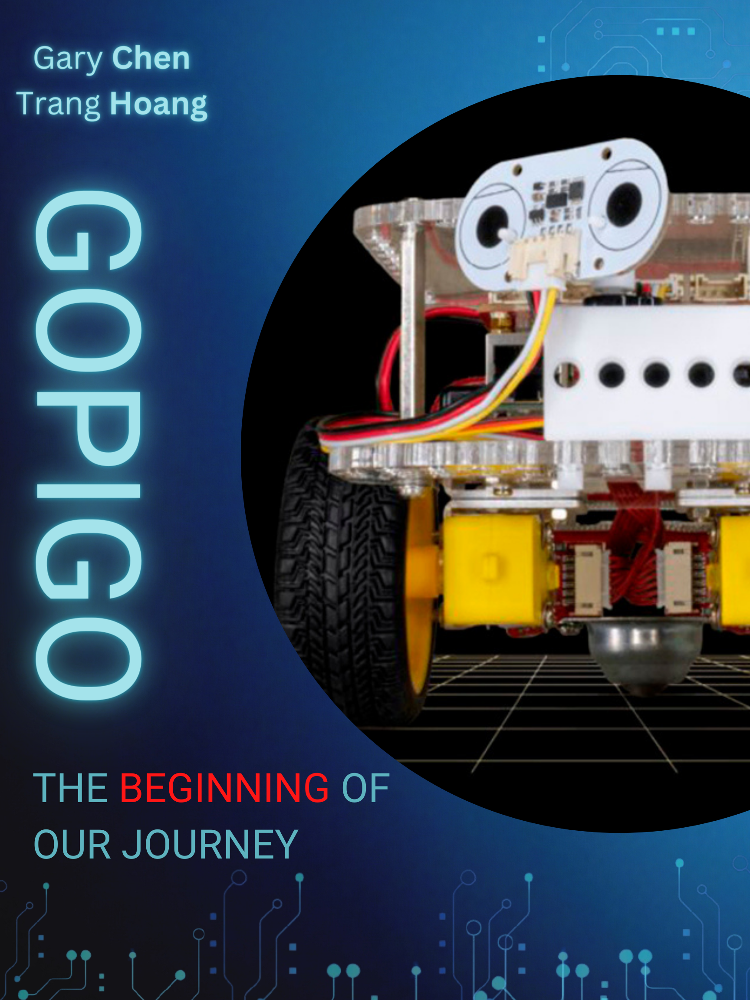

# Shieldbot

## Description

A robot can go around, avoid objects, and play music at the same time. The Shield Bot robot is smart, it will go and find its way through a maze and play music. You will enjoy seeing the robot going and listening to its fun music.

## Robot for Community Demonstrations

Specific detail of the implementation and design: the Shield-Bot robot uses distance sensors to measure the distance to a certain object, when the distance is so short it will turn right to avoid crash. The robot will stop after fixed number of steps. It has a speaker which can play music, and the music will stop when the robot stops running. The program control the robot is written in Python programming language. We use `easygopigo3` and `Pygame` library in the code. Educational efforts of using robots: encourage others to use robots to solve problems in life, foster creativity, and set the base for creating automation robots, develop computational thinking, promote creativity and imagination. Some learning objectives of the demonstrations are giving an example of what robot can do (avoid objects and play music), applying the Python programming skills to program a robot, getting the robot to interact with the real environment. Engagement components: distance sensor, speaker, wheels and a laptop or computer to start the program for the automatic robot.

